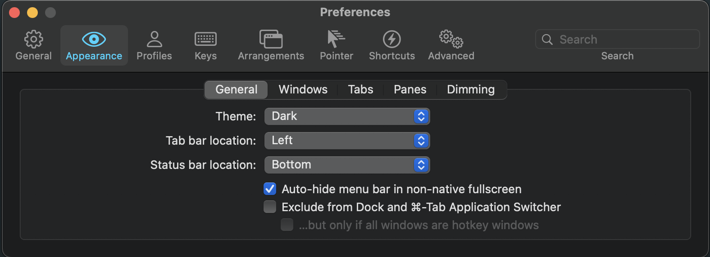
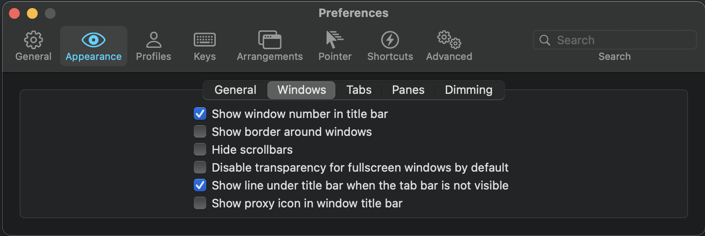
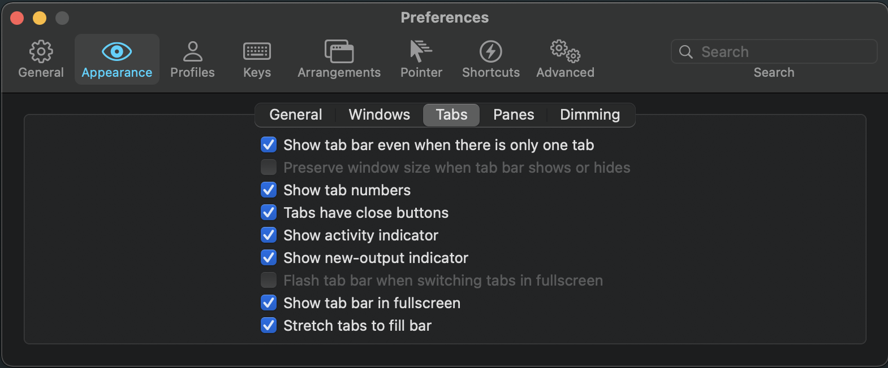
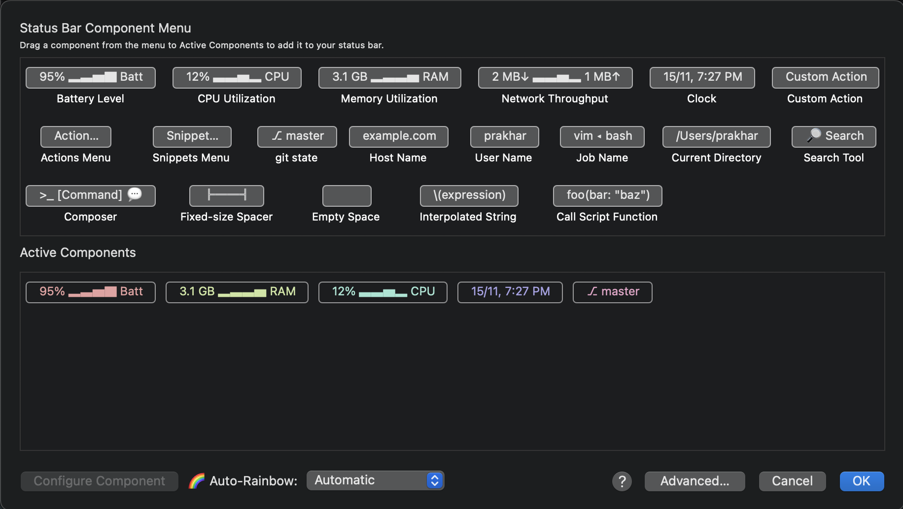

## Terminal Setup from Scratch

This directory includes the steps to setup your terminal from scratch

### What does it do?

* Downloads all the packages that are useful for developers
* Downloads themes

### How does it look

### Installation

* Download [iterm2 for mac](https://www.iterm2.com/downloads.html)
* Run the script `./startup.sh`
* Download [material-design-iterm-colors](https://github.com/MartinSeeler/iterm2-material-design#how-to-use-it)
* Navigate to _Preferences_ > _Appearance_
	* General
	
	* Windows
	
	* Tabs
	
	* Navigate to _Preferences_ > _Profile_ > _Session_ and select `Status bar enabled` and configure
	
* Navigate to _Preferences_ > _Profile_ > _Colors_
  * Select `Import` option in `Color Presets..` dropdown
  * Import the download colors
  * Choose the colors from drop down
* Navigate to _Preferences_ > _Profile_ > _Text_
  * Select font: `Hack Nerd Font`
  
* Replace these lines in `~/.zshrc`
  * `plugins=(git zsh-autosuggestions zsh-syntax-highlighting)`
  * `ZSH_THEME="powerlevel9k/powerlevel9k"`
  * `POWERLEVEL9K_MODE='nerdfont-complete'`
* Run `souce ~/.zsrhc`

_Note_: If this doesn't work. Restart `iterm`
***
